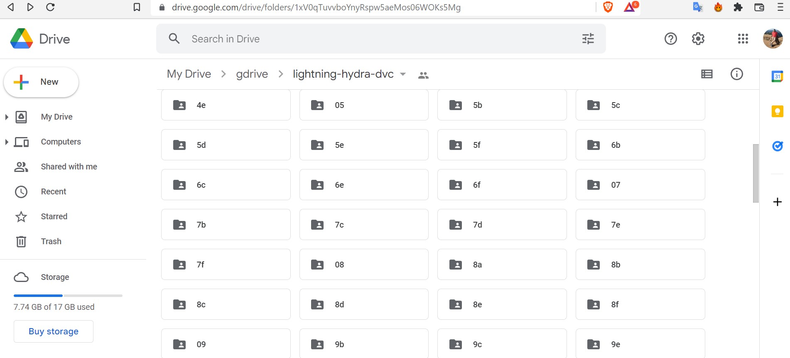
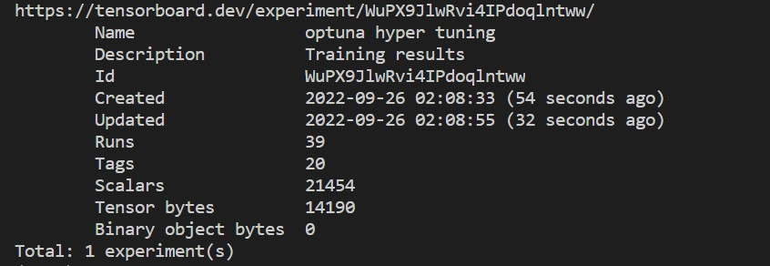
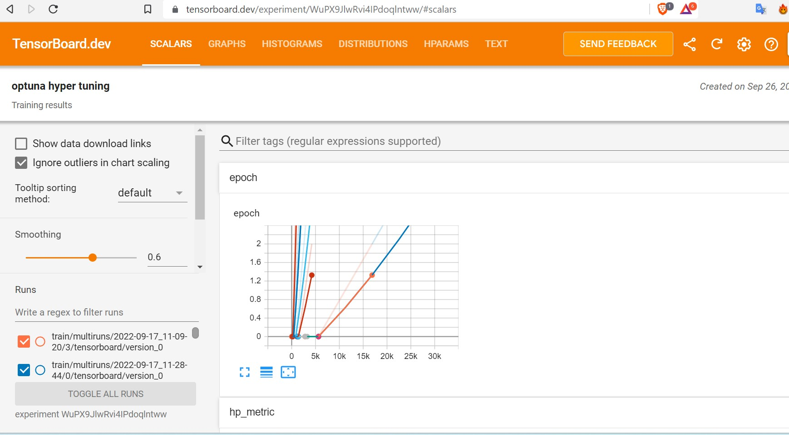
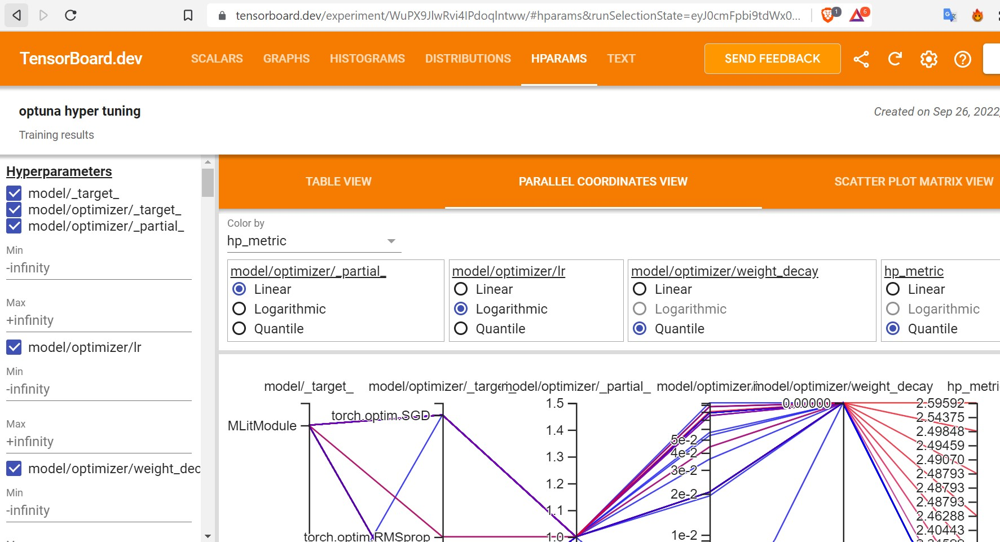

<div align="center">

# Lightning-Hydra-Template with CIFAR Dataset with Optuna + tensorboard

[](https://github.com/pre-commit/pre-commit)
[](https://pytorch.org/get-started/locally/)
[](https://pytorchlightning.ai/)
[](https://hydra.cc/)


<!-- <a href="https://www.python.org/"></a> -->

<!-- <a href="https://pytorch.org/get-started/locally/"></a>
<a href="https://pytorchlightning.ai/"></a>
<a href="https://hydra.cc/"></a>
<a href="https://black.readthedocs.io/en/stable/"></a> -->
</div>

# Experiment Results

- Google drive Link for dvc - <https://drive.google.com/drive/folders/1xV0qTuvvboYnyRspw5aeMos06WOKs5Mg?usp=sharing>

- Tensorboard Link for dvc -  <https://tensorboard.dev/experiment/WuPX9JlwRvi4IPdoqlntww/#scalars>

###### *Training stopped in-between because of CPU training (with less epochs) & failed in colab instance*

Best HyperParameter from experiment

 ```
 name: optuna
 best_params:
    model.optimizer._target_: torch.optim.Adam
    model.optimizer.lr: 0.080057
    datamodule.batch_size: 8

  ```


# DVC Steps
```
dvc add data
dvc add logs
dvc push -r gdrive
```
**Link** : <https://drive.google.com/drive/folders/1xV0qTuvvboYnyRspw5aeMos06WOKs5Mg?usp=sharing>


# Hyper-parameter search Optuna
- Set hyper-parameters for experiment tracking
- Find the best batch_size and learning rate, and optimizer
- Optimizers have to be one of Adam, SGD, RMSProp
 

# Tensorboard  Results

 <https://tensorboard.dev/experiment/HZTVAzfkSDC8EfVfAW99NQ/>

 
 
